# UT Austin Fundraising Analysis
In this project, I am asking the question: who is more likely to donate money to a cause? My hypothesis is that someone who meets a certain set of criteria (ie: age, income, and education level) is more likely to donate then someone who does not meet set criteria. 

I want to address, from a management perspective, the most effective way to utilize resources with the goal of achieving a success rate of over 95% within an 8 hour period. My intention is to give managers a tool that they can use to focus their direct reports' efforts while maximizing time. 

## Overview of the Analysis Scope of the Project
I am demonstrating my knowledge of unsupervised machine learning algorithms. I use Python and the Pandas Library to preprocess the data and K-Means algorithm along with Principal Component Analysis (PCA) to reduce the data to three columns. This will be further explained in the results section of this document. Furthermore, I use a dataset from Kaggle that redacted names, emails, and phone numbers but still contained 14 columns with information ranging from age to education level to marital status and income.

## Resources
- Data Source: Kaggle: Finding Donors for CharityML https://www.kaggle.com/ahmed2892/finding-donors-for-charityml
- Software: Conda 4.11.0 running Jupyter Notebook
- Pandas Libraries: Numpy, MatPlotLib, hvplot, Scikit-learn

## Results
To begin to test my hypothesis, I must first extract and transform the data. There are many constraints and considerations that are taken into account before analyzing the data to answer my questions. 

The following image shows how I load the data into Pandas and create a dataframe of the actual data.
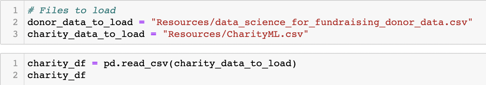
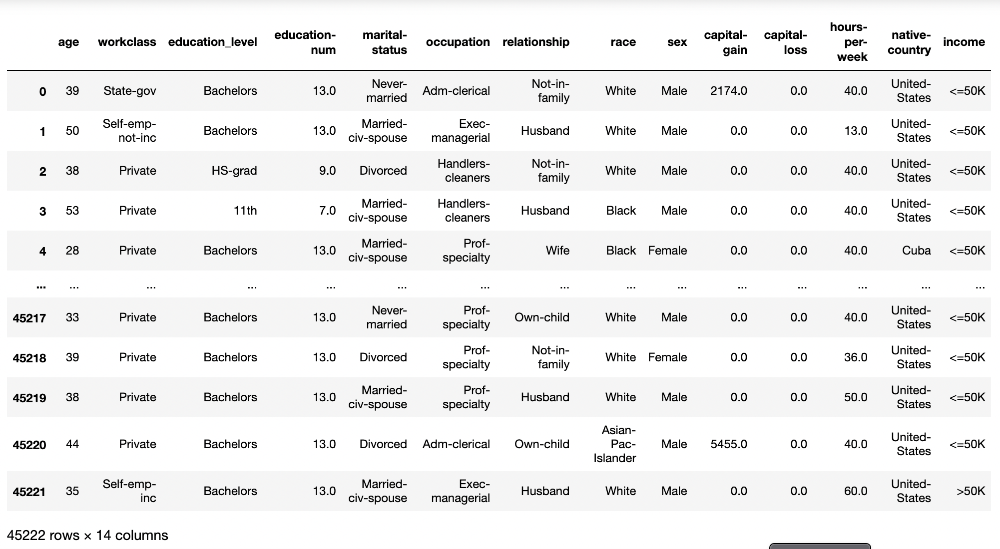

### 1. Data Preprocessing

To begin, I use an f-string print statement to check for null values because unsupervised machine learning (ML) models can not use null values in their algorithm. This is one of the constraints of unsupervised ML models. 
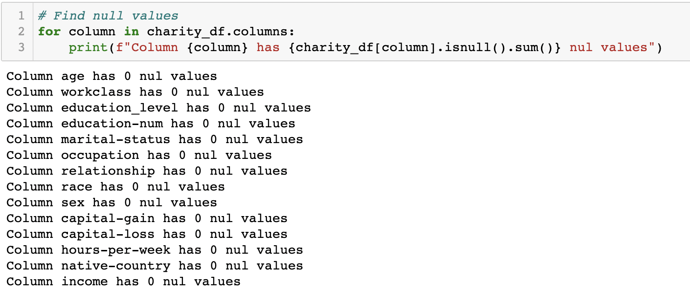

Unnecessary data, or data that doesn't add to the solution, is another consideration when preprocessing your data. This is subjective and must be taken seriously as the analyst might unintentionally introduce biases into the algorithm. 
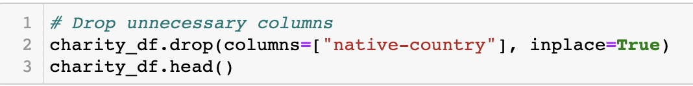

To minimize the spread of numbers in capital gain's column, I divided the entire row by 100. This will put the values in the same range as the rest of the columns without losing any data. Now, the entire dataset is between 1 and 40. 
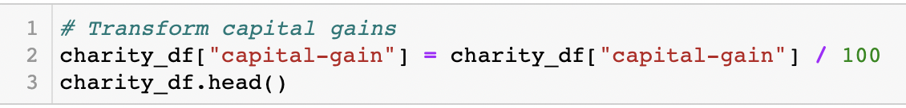

I performed two different functions to numerically describe the remaining columns. The first was from the Pandas library called "get_dummies". This essentially transforms binary data into ones and zeros and creates an extra column. Each column populates with a one and a zero based on the original input. The second function "Label Encoder" comes from the SciKit-Learn library. It transforms each value to a numeric representation of all the categories in that row. 
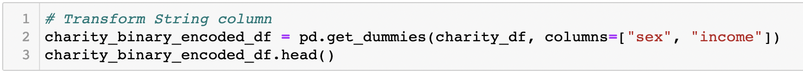
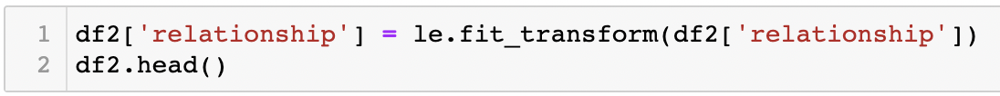

This is the final product as a dataframe ready for the next level of analysis. 
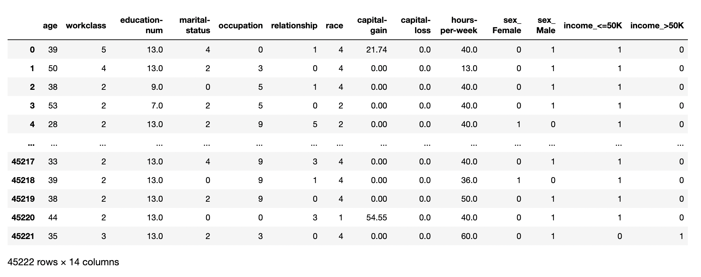

### 2. Cluster Modeling Using PCA

To begin clustering, I utilized an elbow graph to show where increasing the number of clusters no longer caused differences in the results. In other words, I plotted clusters on the x-axis and inertia, which measures the amount of variation in the dataset, on the y-axis. I can now visually see where the point of diminishing return for clustering is reached. In this case, I feel that five clusters will suffice. 
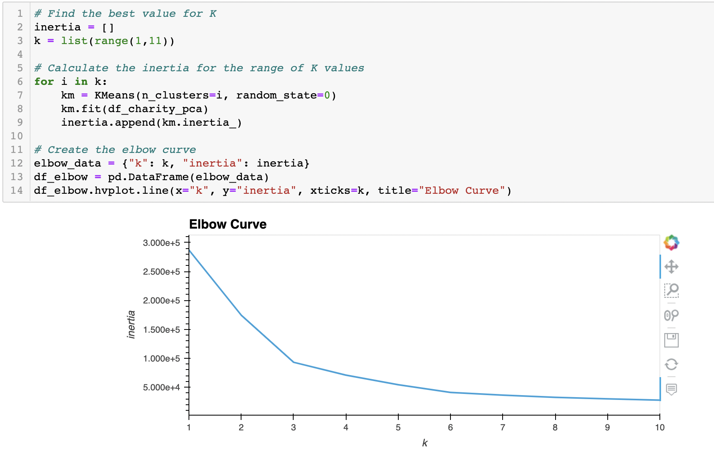

I wanted to further identify clusters and experiment with other means of identifying clusters. So, I implemented Principal Component Analysis. This is a statistical technique to reduce the input features by transforming them into smaller chunks of information that still contains most of the original larger dataset. It employs linear transformations, eigenvectors and eigenvalues to show us the spread of the dataset and by how much. This is a much more complicated process rooted in linear algebra. However, the coding for this is much easier. 
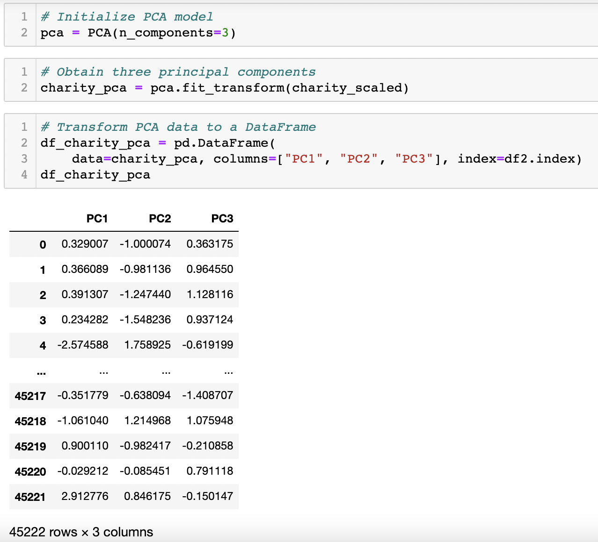

### 3. Outcome

This is a 3D scatter plot of the data. The three principal components are plotted on the x, y, and z axis. As illustrated, the red x's, class 2, have the highest concentration of points. Or, class 2 has the largest cluster of similar or like individuals. 
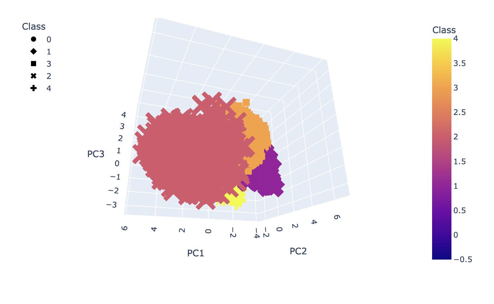

This table can be filtered to show the class and thier associated features (ie: age, workclass, education, etc.) on the same row. 
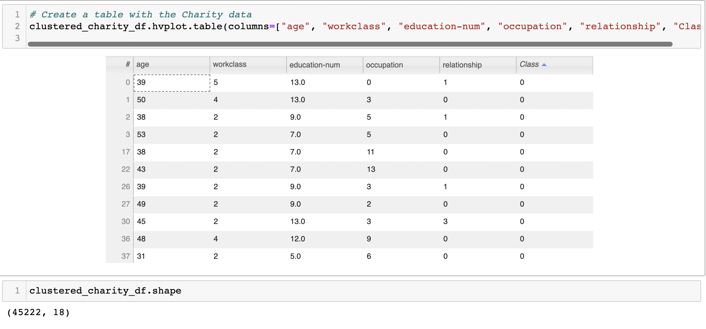

## Summary
It was my hypothesis that I would find trends of more and less likely donors within some combination of features such as income and age. In other words, I expected that perhaps people between ages 40-50 with an income over $50,000 might be more likely to donate. Instead, what I found was that likely donors formed five clusters or classes. And the likelihood of donation is highest at the center of each class. Within each class, each feature (age, income, etc.) could be grouped. Those groups could be further analysized with actual data merged into it to find people that would donate. All classes had likely donors but class 2 had the most, or largest, likely donor list.  The next step would be to merge that database with an existing one. Within the new combinted data set, we should concentrate our efforts on people in class 2 in our model. Then we are more likely to reach our 95% success rate in an 8 hour period. 

## Recommendations
Our next steps would be to:
- tie in UT's donor database to our ML model in order to merge names, phone numbers, and emails
- begin to reach out to those individuals 
- create an on-line repository for staff to enter results of all interactions as successfully donated or not
- with success rate now a new column, we can run a supervised machine learning program to predict who will donate

## Presentation
[Here](website) is a link to a presentation discussing this work. 